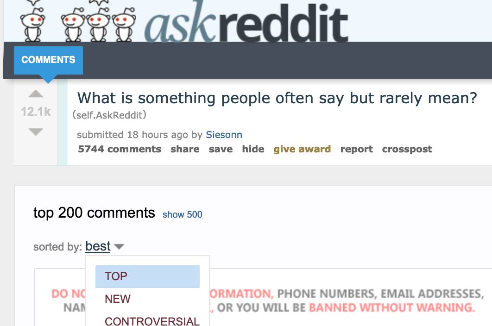
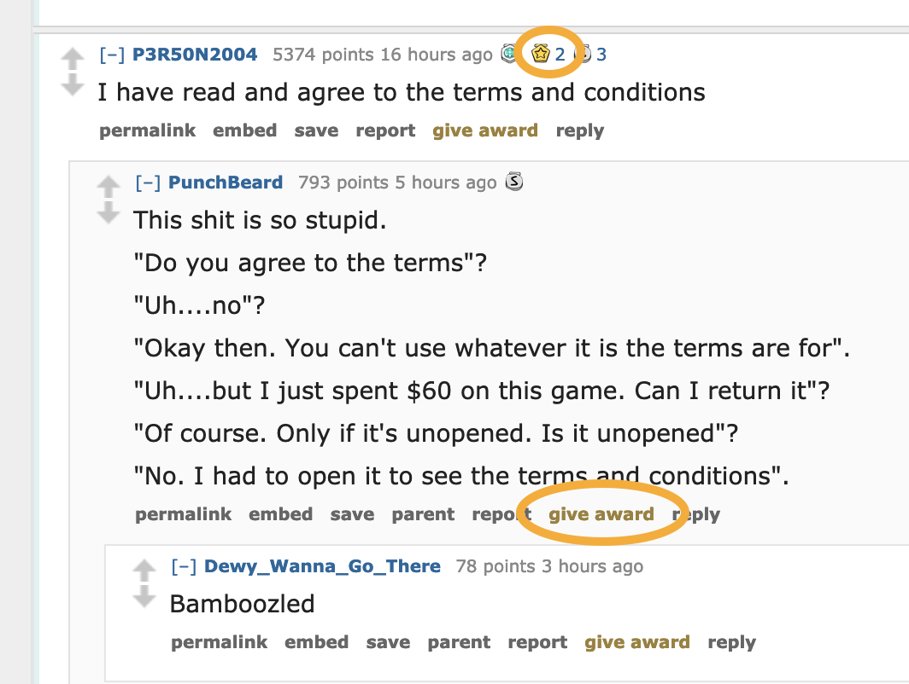

Go For Gold
========
Predicting early endorsement in user-generated content
========

Context
---------

User-generated content has the potential to achieve virality quickly, to the point where such content is even referred to as a 'campaign' - after it has already become one, that is. Some hashtags die, others become part of world history. 

Consumers have become more savvy to the fabricated nature of many traditional forms of social proof, such as 'ambassador-style' brand advocates or "most popular" product sales. In the social media space in particular, one form of social proof retains an air of authenticity: the "early" response and/or endorsement. "Early" responses to content that has latent viral potential carry cultural weight that buys cultural capital, whereas later responses become more likely to invoke the suspicion of "bandwagonism". 

Early endorsement of potentially viral user-generated content represents a brand "spending" attention on something that does not have an immediate obvious payback in terms of exposure (thus gaining perceived authenticity).

Objective
---------
The ability to foresee the imminent virality of user-generated content in the social media space is therefore valuable. Additionally, latent viral potential and presence of early endorsements tend to correlate, with a synergistic effect.

Therefore, this text classifier:
* seeks to identify user-generated content likely to attract early endorsement, in order to "beat" the crowd and get "inb4" the bandwagon effect
* specifically, classifies those top-level comments from a sub-forum that focuses on user-generated content, and that has a mechanism for giving public endorsement to comments (Reddit gold)
* assumes that responding is relatively cheap, while missed opportunities are more expensive. Therefore it aims to catch as many "endorsement-potentials" as possible (true positives), even if it means mistakenly flagging others (false positives).

